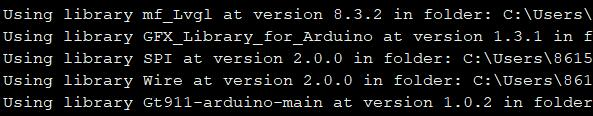

# Makerfabs ESP32-S3 Parallel TFT with Touch 4.3inch

```c++
/*
Version:        V1.1
Author:            Vincent
Create Date:    2022/12/29
Note:
    2023/4/15 V1.2: Update V2.0 hardware.
    2023/1/10 V1.1: Update code to match the V1.3 hardware.
*/
```

[TOC]

# Makerfabs

[Makerfabs home page](https://www.makerfabs.com/)

[Makerfabs Wiki](https://wiki.makerfabs.com/)

# Makerfabs ESP32-S3 Parallel TFT with Touch 4.3inch

## Intruduce

Product Link ：[ESP32-S3 Parallel TFT with Touch 4.3"](https://www.makerfabs.com/esp32-s3-parallel-tft-with-touch-4-3-inch.html)

Wiki Link : [ESP32-S3 Parallel 4.3 TFT with Touch](http://wiki.makerfabs.com/ESP32_S3_Parallel_4.3_TFT_with_Touch.html)

This ESP32 4.3 inch IPS display could be an ideal displayer& controller for IoT applications. Its high lightness IPS display with a resolution of 800*480 makes the display effect beautiful, together with 5 points capacitive touch, great for applications such as home automation; There onboard SD card and RTC, to make it possible to record/play filed data. Also, there 2 Mabee/ Grove connectors, so the users can connect kinds of sensors to this board, to create personal prototype projects instantly.

The ESP32-S3 has WiFi& Bluetooth 5.0, and 8M PSRAM ESP32-S3 is used in this product, with 16M flash, to make it competent for more advanced applications.

## Feature

- Controller: ESP32-S3-WROOM-1, PCB Antenna, 16MB Flash, 8MB PSRAM, ESP32-S3-WROOM-1-N16R8
- On Board RTC
- Wireless: Wifi& Bluetooth 5.0
- LCD: 4.3 inch High Lightness IPS
- FPS: >30
- Resolution: 800*480
- LCD interface: RGB 565
- Touch Panel: 5 Points Touch, Capacitive
- Touch Panel Driver: GT911
- USB: Dual USB Type-C(one for USB-to-UART and one for native USB)
- USB to UART Chip: CP2104
- Power Supply: USB Type-C 5.0V(4.0V~5.25V)
- Button: Flash button and reset button
- Mabee interface: 1*I2C;1*GPIO
- MicroSD: Yes
- Arduino support: Yes
- Type-C Power Delivery: Not Supported
- Operation temperature: -40℃ to +85℃

## Version Attention

### V2.0

The codes has not been modified yet, please wait a little.

Still working...

|           | V2.0 | V1.3 |
| --------- | ---- | ---- |
| LCD_BLK   | NULL | 2    |
| I2S_DIN   | 19   | NULL |
| I2S_BCLK  | 20   | NULL |
| I2S_LRCLK | 2    | NULL |
|           |      |      |

Now the screen has no backlight PWM adjustment function, the pins are assigned to I2S. By default, the hardware backlight is always on.


### V1.3

V1.3 switches the touch screen RST and INT pins compared to V1.1 hardware.

```c++
// Hardware V1.3
#define TOUCH_GT911_SCL 18
#define TOUCH_GT911_SDA 17
#define TOUCH_GT911_INT -1
#define TOUCH_GT911_RST 38
```

### V1.1

If the silk screen on the back of your hardware is V1.1, follow the Branch V1.1 procedure.

# Code

## Complier Option

- Install board : ESP32 (Version 2.0.4)
- Install libraries：



- Use type-c use cable connect USB-TTL to PC.
- Select "ESP32-S3 DEV Module"
- Select PSRAM "OPI PSRAM"

"mf_Lvgl" library is modified from Lvgl library (version 8.3.2). 

Please unzip "lib/mf_Lvgl.zip" and copy to arduino library directory.

## Factory test program

examples\esp32s3_4.3_tft_fw_test

You can run this file test if you feel that your hardware is not working properly. You need to copy the images from the Images folder to the included TF card.